# Cs_WPF_Demos

https://JimFawcett.github.io/Cs_WPF_Demos.html

Demonstration projects for panels, controls, event bubbling, etc

> Note: `WPF_DispatcherDemo` requires a `System.Windows.Forms` reference not available in the SDK-style project and is excluded here.

---

## WPF_AllCode — Drawing with Code

Demonstrates WPF drawing primitives (shapes, geometry, brushes) constructed entirely in C# code rather than XAML.

The `CodeDraw` class subclasses `Window` directly and builds the entire UI in its constructor. A `Canvas` is set as the window's `Content`, and child elements — a `Rectangle`, two `TextBlock`s, a `Line`, and a `Polyline` — are created, styled, and positioned using `Canvas.SetLeft`/`Canvas.SetTop` attached properties. Mouse event handlers on the canvas (`MouseDown`, `MouseUp`, `MouseEnter`, `MouseLeave`) update a status `TextBlock` to show interaction state, demonstrating that all WPF layout, styling, and event wiring that is normally expressed in XAML can be done equivalently in imperative C# code.

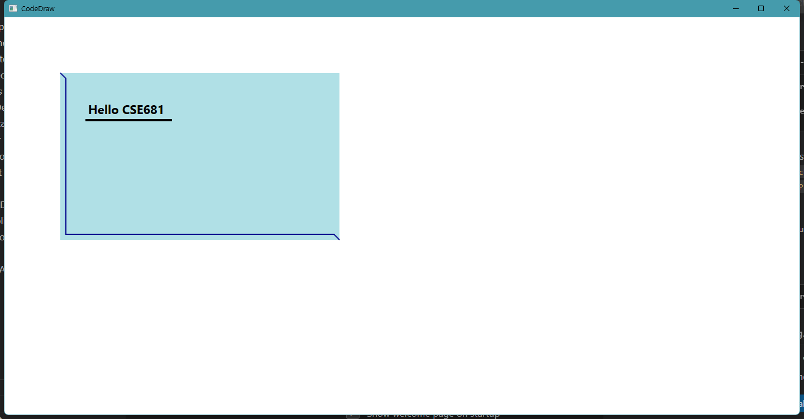 

---

## Wpf_AttachedProperties — Attached Properties Demo

Demonstrates WPF attached properties, showing how controls can carry extra state defined by a different class.

The layout is defined in XAML. A `Grid` splits the window into two rows: the top row holds a `Button` whose height is data-bound to its containing row via `{Binding Path=ActualHeight, ElementName=container}`, so it stretches as the row resizes. The bottom row holds a `DockPanel` whose four child buttons carry `DockPanel.Dock` attached properties (`Left`, `Right`, `Top`, and the remaining fill slot). These properties are defined by `DockPanel`, not by `Button` — that is the core point: attached properties let a parent panel impose layout-specific state on any child element without requiring that element to know anything about the panel.

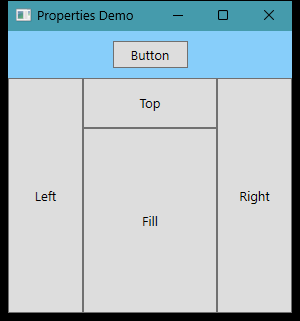 

---

## WPF_BarChart — Bar Chart Drawing Demo

Demonstrates dynamic WPF drawing by constructing a bar chart at runtime using `Rectangle` elements placed on a `Canvas`.

On `Window_Loaded`, X and Y axis lines are sized to fit the canvas, then five `Rectangle` elements are created in code and positioned relative to the X axis — positive-valued bars extend upward, negative-valued bars extend downward. A `Canvas_SizeChanged` handler rescales both axes and repositions all bars using `RenderTransform` offsets so the chart stays correct when the window is resized.

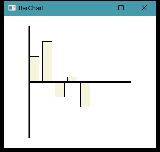 

---

## WPF_ChangeNotification — Property Change Notification

Demonstrates WPF data binding with `INotifyPropertyChanged` so that the UI automatically updates when a bound data object changes.

A `course` class implements `INotifyPropertyChanged` and fires `PropertyChanged` in its `Name` property setter. The window's `Grid` has its `DataContext` set to a `course` instance, and a `TextBlock` binds to `Path=Name`. Clicking the button cycles through a list of course names — each assignment calls `RaisePropertyChanged`, which the binding infrastructure intercepts to push the new value into the `TextBlock` without any manual UI update code.

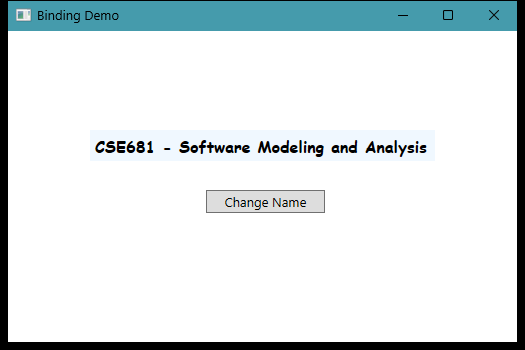 

---

## WPF_Controls — WPF Text and Layout Controls

Demonstrates a range of WPF text and layout controls including `TextBlock`, `FlowDocumentScrollViewer`, `GridSplitter`, and multi-window navigation.

The main window uses a three-row `Grid`: a styled header `Border` with a bold `TextBlock`, a row with two buttons, and a split content area. A `GridSplitter` divides the lower area into a plain `TextBlock` on the left and a `FlowDocumentScrollViewer` on the right. Clicking "Change Text" toggles between a short quote and a long `FlowDocument` paragraph. Clicking "New Form" opens a second window demonstrating additional controls.

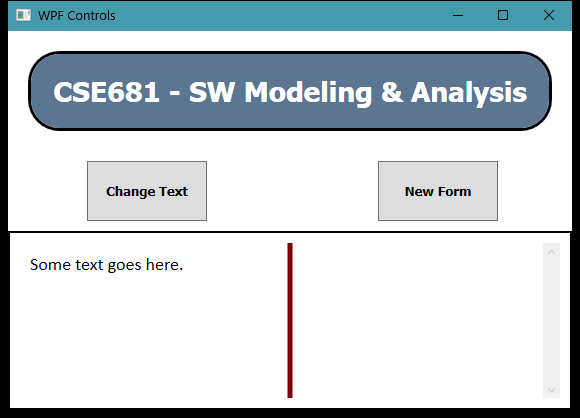 

---

## WPF_ControlTemplate — Control Templates and Styles

Demonstrates how `ControlTemplate` and `Style` resources can completely replace and customize the visual appearance of standard WPF controls.

The window defines two buttons in a `StackPanel`. The first uses an inline `ControlTemplate` that replaces the default button chrome with an `Ellipse` filled by a `RadialGradientBrush` and a centered label — the button is now circular. The second uses a named `Style` resource that sets font, foreground color, and a `LinearGradientBrush` background, plus a `Trigger` that switches the foreground to a gold gradient when `IsPressed` is `True`.

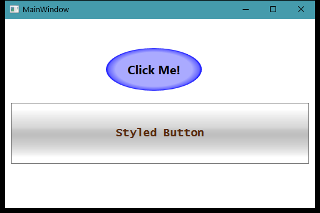 

---

## WPF_CustomElement — Custom UIElement via OnRender

Demonstrates creating a custom WPF element by subclassing `FrameworkElement` and overriding `OnRender` to draw directly with a `DrawingContext`.

`CustomPolyLine` subclasses `FrameworkElement`. Its constructor accepts an origin point and an array of data points, stores them, and applies a `TranslateTransform` to offset the polyline from the origin. `OnRender` draws the X and Y axes as lines using `dc.DrawLine`, then iterates the point array to draw each segment of the polyline — all using raw `Pen` and `Point` objects rather than the higher-level `Shapes` layer.

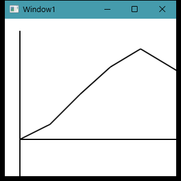 

---

## WPF_DataTemplateDemo — DataTemplate for ListBox Items

Demonstrates using a `DataTemplate` to control how each item in a `ListBox` is rendered, binding multiple properties of a data object to a structured row layout.

A `Course` class with four string properties (`CourseNumber`, `CourseName`, `Semester`, `Instructor`) is used as the item type. On load, six course instances are added to the `ListBox`. The `ListBox.ItemTemplate` defines a `DataTemplate` containing a four-column `Grid` inside a bordered row, with each `TextBlock` bound to one property via `{Binding Path=...}`. Selecting an item triggers a `SelectionChanged` handler that shows a `MessageBox`.

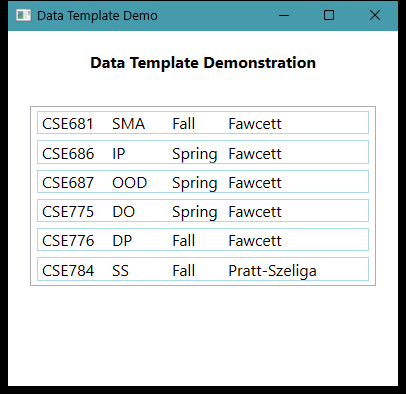 

---

## Wpf_DefaultProject — Default Project Basics

Demonstrates basic WPF application structure: a `TextBox` for input, a `ListBox` for accumulated output, a styled `Button`, and persistent settings.

Clicking "Insert Line" prepends the `TextBox` content to the `ListBox` and re-selects the text. On load, the window reads its size and the initial `TextBox` text from `Properties.Settings` (user-scoped settings). On close, the current values are written back — so window size and the last entered text survive across runs.

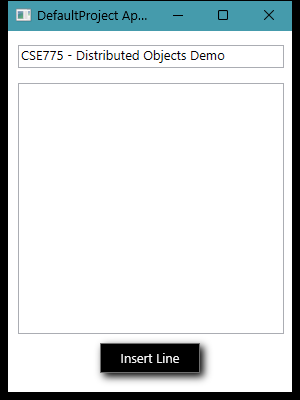 

---

## WPF_DemoPanels — Panel Layout Demos

Five separate projects each demonstrating one WPF panel type with styled buttons.

- **Canvas** — buttons positioned with absolute `Canvas.Top`/`Canvas.Left`/`Canvas.Right`/`Canvas.Bottom` coordinates and `Canvas.ZIndex` layering; a `StatusBar` at the bottom shows mouse-event feedback. 
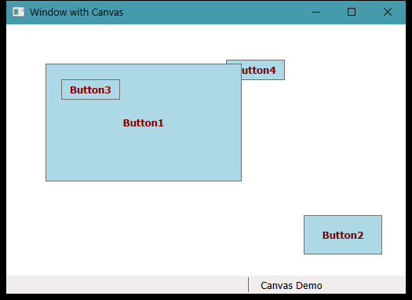 
- **DockPanel** — buttons docked to `Top`, `Bottom`, `Left`, and `Right`; the last child fills remaining space. 
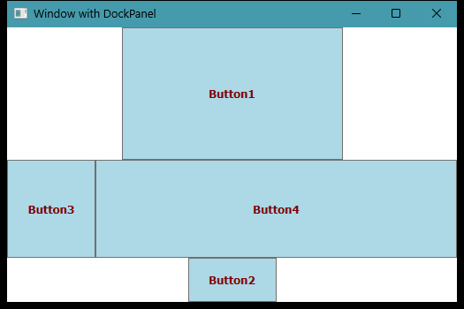 
- **Grid** — a two-row `Grid` with proportional row heights (`*` and `2*`); buttons placed in specific rows stack by z-order within the same cell. 
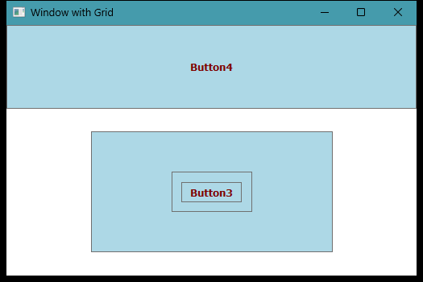 
- **StackPanel** — a vertical `StackPanel` nesting a horizontal inner `StackPanel`, showing how stacks can be composed. 
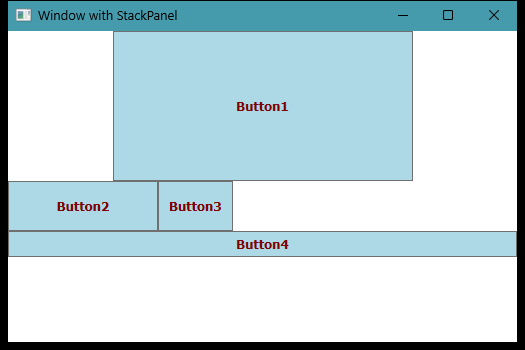 
- **WrapPanel** — buttons flow left-to-right and wrap to the next line when the panel width is exceeded. 
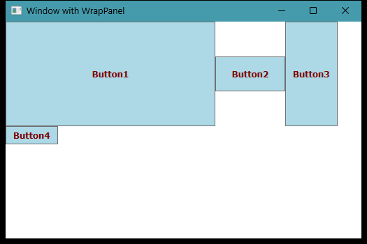 

---

## WPF_DragDropExample — Drag and Drop Diagram Builder

Demonstrates WPF drag-and-drop by building an interactive package diagram editor where components can be dragged from a toolbox onto a drawing canvas.

The window has a narrow left `Canvas` acting as a toolbox containing a `PackageDiagram` shape and a `UsingConnector` shape. The right `Canvas` (`drawingCanvas`) has `AllowDrop="True"` and a `Drop` handler. Each toolbox shape handles `MouseMove` to initiate a drag with `DragDrop.DoDragDrop`, packaging itself as data. On drop, the handler checks the source canvas: if dropping from the toolbox it copies the element; if re-dropping from the drawing canvas it moves it, positioning via `Canvas.SetLeft`/`Canvas.SetTop`. 
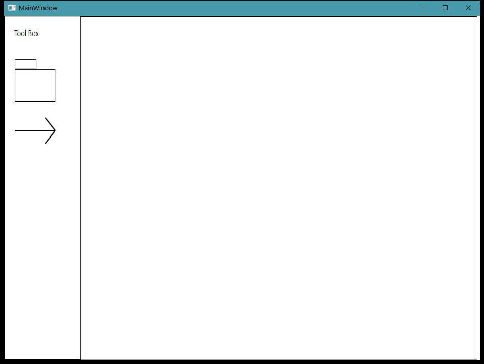 

---

## Wpf_LabManager — NavigationWindow with Pages

Demonstrates WPF page-based navigation using `NavigationWindow` with a series of `Page` objects navigated programmatically.

`Window1` subclasses `NavigationWindow` with `ShowsNavigationUI = false`, suppressing the default back/forward chrome. The initial source is `Page1.xaml`; each page contains its own layout and navigates forward or backward by calling `NavigationService.Navigate` or `NavigationService.GoBack`. This shows how a WPF application can present a multi-step workflow or wizard using the built-in navigation framework. 
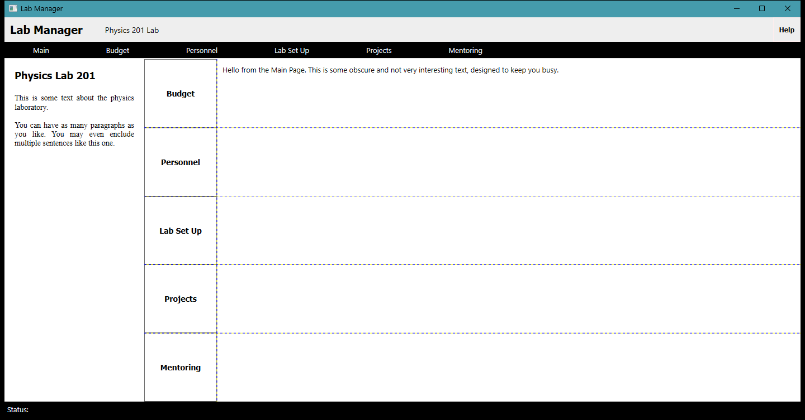 

---

## WPF_MessageHook — Win32 Message Hook

Demonstrates hooking into the Win32 message loop from a WPF application using `HwndSource` and `HwndSourceHook` to intercept and display raw Windows messages.

A `List<Win32Msg>` maps known message codes (WM_CREATE, WM_MOVE, WM_LBUTTONDOWN, WM_PAINT, etc.) to their names. After the window is fully initialized, `src.AddHook(HandleMessages)` installs the hook. Each incoming message is looked up by value; matching messages are inserted at the top of a `ListBox` via a `DataTemplate` showing message name, hex value, and a render counter. A separate `CompositionTarget.Rendering` subscription counts WPF render passes. A checkbox toggles whether `WM_MOUSEMOVE` messages are shown. 
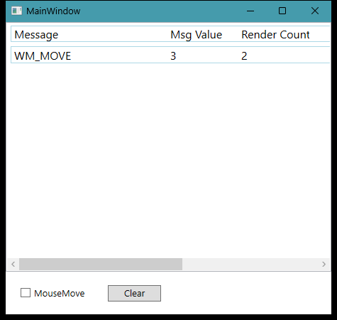 

---

## Wpf_RoutedEvent — Routed Events Demo

Demonstrates WPF routed events by showing how a `Click` event on a nested element bubbles up through the visual tree and how `MouseEnter`/`MouseLeave` events can be handled at multiple levels independently.

A `Button` contains a `DockPanel` holding an `Image` docked to the top and a `Label` docked to the bottom. Each of the three elements (`Button`, `Image`, `Label`) has its own `MouseEnter`/`MouseLeave` handlers that update the window title to identify which element the mouse is over. Because routed events bubble, the `button1_Click` handler fires regardless of whether the click lands on the image or the label — both are inside the button's hit-test area. 
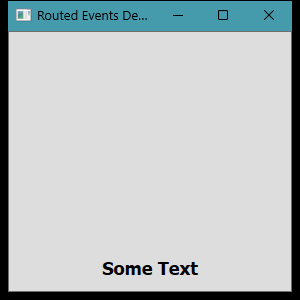 

---

## Wpf_Triggers — Styles and Triggers

Demonstrates WPF `Style` resources and property `Trigger`s to change control appearance reactively without code-behind.

A window-level `Style` targets all `Button` elements and sets font, foreground color, and a gold `LinearGradientBrush` background. The `Style.Triggers` collection adds a `Trigger` on `IsMouseOver = True` that applies an `OuterGlowBitmapEffect` with a red glow — so hovering over the button adds a visible glow without any C# event handler. A `Button_Click` handler and a `Button_MouseEnter` handler both write status text to a `TextBox`, illustrating that triggers and code-behind handlers coexist. 
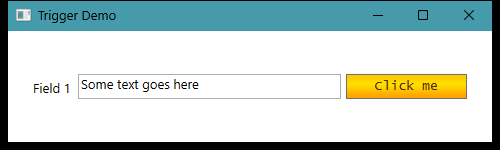 

---

## WPF_UserControlDemo — Custom UserControl with DispatcherTimer

Demonstrates creating a reusable WPF `UserControl` (a timer display) and hosting it in a parent window.

`Timer.xaml` defines a `UserControl` containing a `TextBlock` for elapsed milliseconds and Start/Stop buttons, all in a `StackPanel` inside a bordered frame. `Timer.xaml.cs` creates a `DispatcherTimer` that ticks every 10ms and updates the `TextBlock` on the UI thread. The host window `Window1.xaml` references the control via an `xmlns` namespace alias and places it with `<uc1:Timer>`, plus a Reset button that calls `TimerControl.ResetTimer()`. This shows the full authoring, packaging, and consumption lifecycle of a WPF user control. 
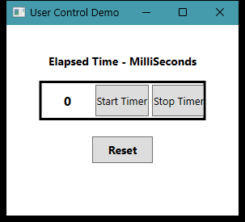 
